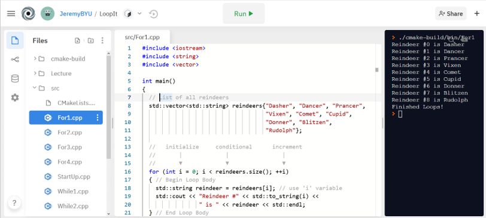

# Loop It - C++ Loops Explained

This repository contains a PowerPoint lecture and accompanying source code to teach about C++ Loops. The code can run online using repl.it using or locally per the procedures below.

## Run Online

Click this button: 

This should open up a website with a full editor and c++ compiler. The projects has already been configured as well, just click the green 'Run' button at the top.

In the editor on the left, open the `src` folder and make changes to any source file! Recompile by clicking the 'Run' button 

## Run Local

### Setup

Make sure that you have CMake and a C++ Compiler installed on your system.

### Build

1. `mkdir cmake-build && cd cmake-build` - Create build directory
2. `cmake -DCMAKE_BUILD_TYPE=Release ..` - Configure build tools. For windows also add `-DCMAKE_GENERATOR_PLATFORM=x64`
3. `cmake --build . -j4 --config Release` -  Build project

### Run

The programs are in `cmake-build/bin` directory. For example `./cmake-build/bin/While1` will run the first program.
